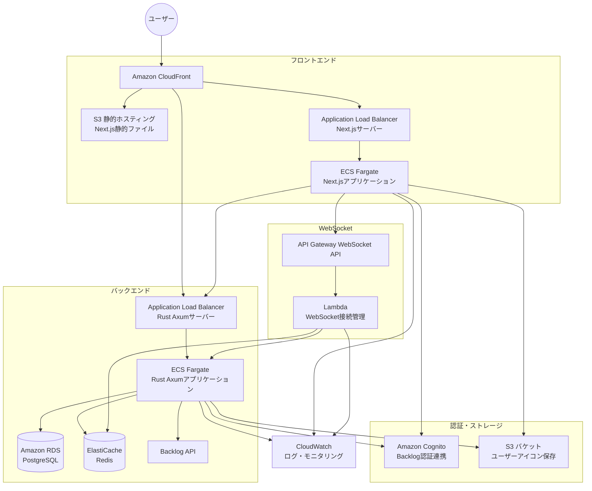

```mermaid
flowchart TD
    User((ユーザー)) --> CloudFront[Amazon CloudFront]
    
    subgraph "フロントエンド"
        CloudFront --> S3[S3 静的ホスティング\nNext.js静的ファイル]
        CloudFront --> ALB1[Application Load Balancer\nNext.jsサーバー]
        ALB1 --> ECS1[ECS Fargate\nNext.jsアプリケーション]
    end
    
    subgraph "バックエンド"
        ALB2[Application Load Balancer\nRust Axumサーバー] --> ECS2[ECS Fargate\nRust Axumアプリケーション]
        ECS2 --> RDS[(Amazon RDS\nPostgreSQL)]
        ECS2 --> ElastiCache[(ElastiCache\nRedis)]
        ECS2 --> BacklogAPI[Backlog API]
    end
    
    subgraph "WebSocket"
        ApiGateway[API Gateway WebSocket API] --> Lambda[Lambda\nWebSocket接続管理]
        Lambda --> ECS2
        Lambda --> ElastiCache
    end
    
    CloudFront --> ALB2
    ECS1 --> ALB2
    ECS1 --> ApiGateway
    
    subgraph "認証・ストレージ"
        Cognito[Amazon Cognito\nBacklog認証連携]
        S3Image[S3 バケット\nユーザーアイコン保存]
    end
    
    ECS1 --> Cognito
    ECS2 --> Cognito
    ECS1 --> S3Image
    ECS2 --> S3Image
    
    CloudWatch[CloudWatch\nログ・モニタリング]
    ECS1 --> CloudWatch
    ECS2 --> CloudWatch
    Lambda --> CloudWatch
```